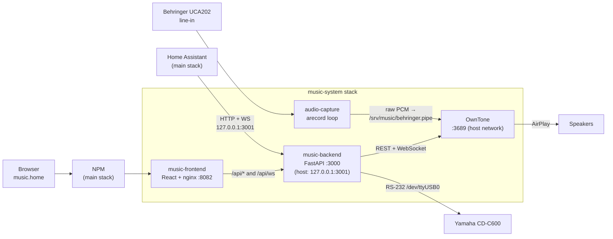

# music-system

The home music system on the server **Wyse** (`192.168.1.199`). It combines two
sources into one web UI and one Home Assistant integration:

- **Music library and live input**, played by [OwnTone](https://owntone.github.io/owntone-server/) and streamed to AirPlay speakers.
- **A Yamaha CD-C600 CD changer**, controlled over RS-232 serial.

This repo is a self-contained stack with its own `docker-compose.yml` and
systemd unit. It runs next to the main server stack
([homelab-configs](https://github.com/kurzepajedrzej/homelab-configs)) but
never depends on it. If the music stack fails, DNS, the dashboard, media, and
Home Assistant keep running.

**Open it:** [music.home](http://music.home)

---

## Architecture



### Containers

| Container | What it does |
|---|---|
| `owntone` | Music server. Serves the library in `/srv/music`, plays the live-input pipe as a track, and streams to AirPlay outputs. Uses host networking so AirPlay/mDNS discovery works. |
| `audio-capture` | Records the Behringer UCA202 line input (the CD deck's analog output) as raw PCM into the FIFO `/srv/music/behringer.pipe`. A retry loop restarts `arecord` whenever OwnTone stops reading the pipe, so there's no audible pop. |
| `music-backend` | Python/FastAPI. A single API in front of OwnTone and the CD deck (see below). |
| `music-frontend` | React + TypeScript + Vite app served by nginx. Proxies `/api/*` to the backend. |

### The backend

`music-backend` is the only thing the UI and Home Assistant talk to. It does
three jobs in one process, which saves RAM on a 1.8 GB machine:

1. **OwnTone facade.** Proxies player, queue, library, search, outputs, and
   artwork calls to OwnTone's REST API.
2. **CD control.** Drives the CD-C600 directly over serial (`app/cdplayer/`),
   with locking and optimistic state updates.
3. **Unified live updates.** `/api/ws` merges OwnTone's WebSocket events with
   CD-deck state changes into one stream, so clients subscribe once.

API surface (all under `/api`):

| Route | Purpose |
|---|---|
| `GET /health`, `GET /health/pipe` | Health of OwnTone, the CD deck, and the audio pipe |
| `GET /state` | Combined player and CD snapshot |
| `/player` | Play, pause, next, seek, volume |
| `/queue`, `/library`, `/search` | Browse the library and queue tracks |
| `/outputs` | List and enable AirPlay speakers |
| `/source/cd`, `/source/library` | Switch between CD input and library playback |
| `/cd/status`, `/cd/disc/{n}`, `/cd/track/{n}`, `/cd/{cmd}` | CD changer control |
| `/artwork/album/{id}`, `/artwork/item/{id}` | Cover art |
| `WS /ws` | Live update stream |

### How CD playback works

The CD deck isn't a digital source. Its **analog output** goes into the
Behringer UCA202, `audio-capture` writes that audio into a pipe, and OwnTone
plays the pipe like any other track. Playing a CD is therefore two separate
actions:

- `POST /api/source/cd` points OwnTone at the pipe track.
- `POST /api/cd/...` presses the deck's buttons over serial.

### Home Assistant integration

`homeassistant/` is a Home Assistant custom integration. It isn't a container.
It exposes the CD deck and the unified player as entities: two media players,
a power switch, buttons for tray, disc, search, repeat, and random, and a
track-select number.

It's deployed by bind mount. The main stack's `homeassistant` container mounts
`homeassistant/custom_components/music_system` from this checkout, read-only.
To update it, `git pull` here and restart Home Assistant.

Home Assistant runs on the host network, so it can't resolve Docker container
names. It reaches the backend at the stable loopback address
**`127.0.0.1:3001`**. Don't configure it with the container's internal IP,
because that IP changes whenever the container is recreated.

---

## Repo layout

```
music-system/
├── docker-compose.yml          # the 4 containers + internal "music" network
├── versions.env                # image tags used by compose (written by build-image.sh)
├── startup.sh                  # what music-system.service runs
├── systemd/music-system.service
├── scripts/build-image.sh      # build + version-tag backend/frontend images
├── owntone/owntone.conf        # OwnTone config (mounted read-only)
├── backend/                    # FastAPI service  → see backend/README.md
├── frontend/                   # React UI         → see frontend/README.md
├── homeassistant/              # HA custom integration + tests
└── CLAUDE.md                   # full operational notes and known traps
```

---

## Deploying

The stack runs as a systemd oneshot unit that starts at boot, after the main
stack and after `/dev/ttyUSB0` appears:

```bash
systemctl status music-system.service
systemctl restart music-system.service
```

`music-backend` and `music-frontend` run from **pre-built, version-tagged
images**. A restart never rebuilds them. After changing their source, run
these on the server:

```bash
cd /root/Projects/music-system
git pull
./scripts/build-image.sh music-backend  /root/Projects/music-system/backend
./scripts/build-image.sh music-frontend /root/Projects/music-system/frontend   # only if frontend changed
docker compose --env-file versions.env up -d
```

`build-image.sh` tags each image `<VERSION>-<git short sha>` and records the tag
in `versions.env`. Bump `backend/VERSION` or `frontend/VERSION` by hand for
meaningful changes. `versions.env` is generated on the server, so commit it
from there.

Always pass `--env-file versions.env` to `docker compose`. Without it, the
image tags resolve to empty values and compose fails.

---

## Local development

```bash
# backend
cd backend && uv sync && uv run uvicorn app.main:app --reload --port 3000
cd backend && uv run pytest -v

# frontend (proxies /api to localhost:3000)
cd frontend && npm install && npm run dev

# Home Assistant integration tests
cd homeassistant && uv run pytest -v
```

---

## Troubleshooting

| Symptom | Likely cause |
|---|---|
| `music-backend` stuck in `Created` (`docker ps -a`) | `/dev/ttyUSB0` was missing when it started. Reconnect the adapter, then `systemctl restart music-system.service` |
| UI loads but CD controls fail | Same as above. The frontend stays up by design even when the backend is down |
| No sound from CD source | Check the Behringer (`arecord -l` should list `USB Audio CODEC`) and the `audio-capture` logs |
| CD entities `unavailable` in Home Assistant | Backend is down, or the `127.0.0.1:3001` port mapping is gone |
| Code change not live after restart | The image wasn't rebuilt. Run `build-image.sh`, then `up -d` |

Health at a glance:

```bash
curl -s http://127.0.0.1:3001/api/health   # {"owntone":true,"cd":true,"pipe":true}
```

For the deeper traps, see [CLAUDE.md](CLAUDE.md): serial DTR/RTS quirks,
OwnTone artwork paths, and the UCA202 enumerating as `CODEC`. For the serial
protocol, see [backend/README.md](backend/README.md).
